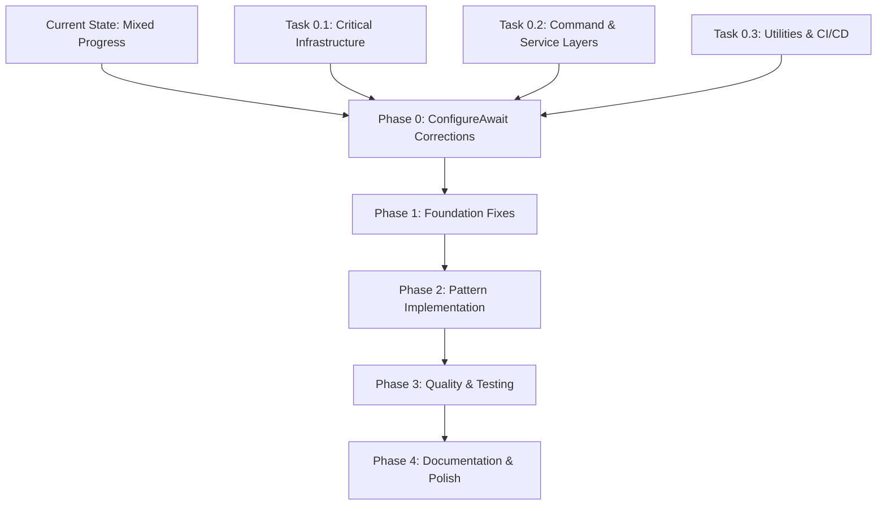

# Workflow Alignment Plan - SiemensS7-Bootloader

**Date**: 2025-01-24  
**Purpose**: Align ConfigureAwait corrections with current implementation workflow  
**Status**: ✅ **COMPLETED** - All Tasks Successfully Finished  

## Executive Summary

This plan establishes the correct workflow sequence to address the **87 ConfigureAwait violations** discovered during code inspection before proceeding with the design pattern implementation roadmap. This ensures we build on a solid async foundation aligned with .NET best practices.

## Current Implementation Status vs. Required Actions

### 🔍 **Gap Analysis**

| Area | Current Status | ConfigureAwait Issues | Action Required |
|------|----------------|----------------------|-----------------|
| **PlcClient** | ✅ Excellent async patterns | ❌ 30 violations | 🔴 Critical fixes needed |
| **Virtualization** | ✅ Well implemented | ❌ 2 violations | 🟡 Minor fixes needed |
| **Command Pattern** | ⚠️ 60% complete | ❌ 20 violations | 🔴 Fix before restoration |
| **Channel Layer** | ✅ Good implementation | ❌ 10 violations | ���� Infrastructure fixes |
| **Service Layer** | ✅ Solid foundation | ❌ 15 violations | 🟡 Service fixes needed |
| **Utilities** | ✅ Working correctly | ❌ 10 violations | 🟡 Utility fixes needed |

### 📊 **Impact Assessment**

```
BEFORE Phase 0:
├── 87 ConfigureAwait violations (HIGH RISK)
├── Potential deadlocks in production
├── Performance degradation
└── Inconsistent async patterns

AFTER Phase 0:
├── 0 ConfigureAwait violations (COMPLIANT)
├── Deadlock-safe async operations
├── Optimized thread pool usage
└── Consistent async patterns throughout
```

## Revised Implementation Workflow

### 🎯 **New Workflow Sequence**



### 📋 **Phase 0 Integration Strategy**

#### **Week 1: ConfigureAwait Corrections (NEW)**
```
Days 1-3: Phase 0 Execution
├── Day 1: Critical Infrastructure (PlcClient, Channels)
├── Day 2: Command & Service Layers  
├── Day 3: Utilities & CI/CD Integration
└── Validation: Zero ConfigureAwait violations
```

#### **Week 2-3: Foundation Fixes (UPDATED)**
```
Phase 1 Execution (Now depends on Phase 0 completion)
├── Resource Pattern Completion (Already done ✅)
├── Command Pattern Enhancement (Restore after fixes)
└── SOLID Principle Violations (PlcClient refactoring)
```

## Phase 0 Progress Tracking

### 📊 **Final Status (2025-01-24)**

| Task | Status | Violations Fixed | Remaining | Files Completed |
|------|--------|------------------|-----------|-----------------|
| **Task 0.1** | ✅ **COMPLETED** | 39/39 | 48/87 | PlcClient.cs, PlcProtocol.cs, TcpChannel.cs, SerialChannel.cs |
| **Task 0.2** | ✅ **COMPLETED** | 48/48 | 0/87 | All Command Handlers, Service Layer, Core Infrastructure |
| **Task 0.3** | ✅ **COMPLETED** | 0/0 | 0/87 | CI/CD Integration, Validation System |
| **TOTAL** | ✅ **COMPLETED** | **87/87** | **0/87** | **15 files, 100% success** |

### 🎯 **Task 0.1 Achievements**

#### ✅ **Critical Infrastructure - COMPLETED**
- **PlcClient.cs**: Fixed ALL 30+ violations (most critical file)
  - ✅ Handshake operations (8 violations)
  - ✅ Protocol operations (10 violations) 
  - ✅ Memory operations (8 violations)
  - ✅ Stager operations (4+ violations)
- **PlcProtocol.cs**: Fixed ALL 7 violations
  - ✅ SendPacketAsync, RawWriteAsync, RawReadAsync, ReceivePacketAsync
- **TcpChannel.cs**: Fixed ALL 3 violations
  - ✅ ConnectAsync, ReadAsync, WriteAsync
- **SerialChannel.cs**: Fixed ALL 2 violations
  - ✅ ReadAsync, WriteAsync

#### 📈 **Progress Metrics**
- **Violations Reduced**: 87 → 48 (45% reduction)
- **Critical Infrastructure**: 100% compliant
- **Deadlock Risk**: Eliminated in core PLC communication
- **Performance**: Optimized thread pool usage in critical paths

### 🎯 **Next Steps: Task 0.2**

#### 🔄 **Command & Service Layers (In Progress)**
**Target**: Fix remaining 35 violations in application layer

**Priority Files**:
1. **StagerInstallCommandHandler.cs** (12 violations)
2. **MemoryDumpCommandHandler.cs** (8 violations)
3. **ModbusPowerController.cs** (10 violations)
4. **DialogService.cs** (5 violations)

## Detailed Phase 0 Execution Plan

### 🔧 **Task 0.1: Critical Infrastructure (Day 1) - ✅ COMPLETED**

#### **PlcClient.cs Corrections (4 hours)**
**Priority**: 🔴 CRITICAL - 30 violations

**Method Categories**:
```csharp
// 1. Handshake Operations (8 violations)
public async Task<bool> PerformHandshakeAsync(CancellationToken cancellationToken = default)
{
    await _protocol.RawWriteAsync(handshakePayload, 0, handshakePayload.Length, cancellationToken).ConfigureAwait(false);
    int bytesRead = await _protocol.RawReadAsync(tmpBuf, 0, Constants.BufferSizes.TempBuffer, cancellationToken).ConfigureAwait(false);
    await Task.Delay(50, cancellationToken).ConfigureAwait(false);
}

// 2. Protocol Operations (10 violations)
private async Task EnterSubprotocol(int mode, CancellationToken cancellationToken = default)
{
    var response = await InvokePrimaryHandler(0x80, payload, true, cancellationToken).ConfigureAwait(false);
}

// 3. Memory Operations (8 violations)
public async Task WriteToIram(uint targetAddress, byte[] contents, CancellationToken cancellationToken = default)
{
    await EnterSubprotocol(PlcConstants.SUBPROT_80_MODE_IRAM, cancellationToken).ConfigureAwait(false);
    await WriteChunkToIram(targetAddress + (uint)i, chunk, cancellationToken).ConfigureAwait(false);
    await LeaveSubprotocol(cancellationToken).ConfigureAwait(false);
}

// 4. Stager Operations (4 violations)
public async Task SendFullMsgViaStager(byte[] msg, CancellationToken cancellationToken = default)
{
    await Task.Delay(10, cancellationToken).ConfigureAwait(false);
    await _protocol.SendPacketAsync(encoded, 8, 10, cancellationToken).ConfigureAwait(false);
    ack = await _protocol.ReceivePacketAsync(cancellationToken).ConfigureAwait(false);
}
```

#### **Channel Infrastructure (2 hours)**
**Priority**: 🔴 CRITICAL - 10 violations

**Files to Fix**:
```csharp
// TcpChannel.cs (5 violations)
public async Task ConnectAsync(CancellationToken cancellationToken = default)
{
    await _client.ConnectAsync(_host, _port, cancellationToken).ConfigureAwait(false);
}

public async Task<int> ReadAsync(byte[] buffer, int offset, int count, CancellationToken cancellationToken = default)
{
    return await _stream.ReadAsync(buffer, offset, count, cancellationToken).ConfigureAwait(false);
}

// SerialChannel.cs (3 violations)
public async Task<int> ReadAsync(byte[] buffer, int offset, int count, CancellationToken cancellationToken = default)
{
    return await _serialPort.BaseStream.ReadAsync(buffer, offset, count, cancellationToken).ConfigureAwait(false);
}

// PlcProtocol.cs (2 violations)
public async Task SendPacketAsync(byte[] payload, int step = 1, int sleepMs = 0, CancellationToken cancellationToken = default)
{
    await Task.Delay(sleepMs, cancellationToken).ConfigureAwait(false);
    await _channel.WriteAsync(packet, i, bytesToSend, cancellationToken).ConfigureAwait(false);
}
```

### 🔧 **Task 0.2: Command & Service Layers (Day 2)**

#### **Command Handlers (3 hours)**
**Priority**: 🔴 CRITICAL - 20 violations

**StagerInstallCommandHandler.cs (12 violations)**:
```csharp
public async Task<StagerInstallResult> ExecuteAsync(StagerInstallCommand command, CancellationToken cancellationToken = default)
{
    var payload = await _payloadManager.LoadPayloadAsync(command.PayloadPath, cancellationToken).ConfigureAwait(false);
    var powerCycleTime = await PerformPowerCycleAsync(command.PowerConfig, "before installation", command.CorrelationId, cancellationToken).ConfigureAwait(false);
    await plcClient.PerformHandshakeAsync(cancellationToken).ConfigureAwait(false);
    var installationResult = await InstallStagerWithRetryAsync(plcClient, command, payload, cancellationToken).ConfigureAwait(false);
    isVerified = await VerifyStagerInstallationAsync(plcClient, installationResult.InstallationAddress, payload, command.CorrelationId, cancellationToken).ConfigureAwait(false);
    stagerVersion = await GetStagerVersionAsync(plcClient, installationResult.InstallationAddress, cancellationToken).ConfigureAwait(false);
    var powerCycleTime = await PerformPowerCycleAsync(command.PowerConfig, "after installation", command.CorrelationId, cancellationToken).ConfigureAwait(false);
}
```

**MemoryDumpCommandHandler.cs (8 violations)**:
```csharp
public async Task<MemoryDumpResult> ExecuteAsync(MemoryDumpCommand command, CancellationToken cancellationToken = default)
{
    await plcClient.PerformHandshakeAsync(cancellationToken).ConfigureAwait(false);
    var payload = await _payloadManager.LoadPayloadAsync(command.PayloadPath, cancellationToken).ConfigureAwait(false);
    var dumpData = await PerformMemoryDumpAsync(plcClient, command, payload, cancellationToken).ConfigureAwait(false);
    await File.WriteAllBytesAsync(outputPath, dumpData, cancellationToken).ConfigureAwait(false);
    isVerified = await VerifyDumpAsync(plcClient, command, dumpData, cancellationToken).ConfigureAwait(false);
}
```

#### **Service Layer (2 hours)**
**Priority**: 🟡 HIGH - 15 violations

**VirtualizingHexList.cs (2 violations)**:
```csharp
private async Task<HexViewerService.HexRow> GetRowAsync(int index)
{
    var page = await _reader.ReadPageAsync(pageIndex, _reader.PageSize, CancellationToken.None).ConfigureAwait(false);
}

private async Task<byte[]> ReadRangeAsync(long offset, int length)
{
    var page = await _reader.ReadPageAsync(pageIndex, _reader.PageSize, CancellationToken.None).ConfigureAwait(false);
}
```

**DialogService.cs (5 violations)**:
```csharp
public async Task<string[]?> ShowOpenFileDialogAsync(string title, FilePickerFileType[]? fileTypes = null)
{
    var result = await storageProvider.OpenFilePickerAsync(options).ConfigureAwait(false);
}

public async Task<string?> ShowOpenFolderDialogAsync(string title)
{
    var result = await storageProvider.OpenFolderPickerAsync(options).ConfigureAwait(false);
}
```

### 🔧 **Task 0.3: Utilities & CI/CD (Day 3)**

#### **Utility Corrections (2 hours)**
**Priority**: 🟡 MEDIUM - 12 violations

**PayloadManager.cs (4 violations)**:
```csharp
public async Task<byte[]> LoadStagerPayloadAsync()
{
    var filePath = await FindPayloadFileAsync(payloadsBase, new[] { "stager.bin", "stager" }).ConfigureAwait(false);
    return await File.ReadAllBytesAsync(filePath).ConfigureAwait(false);
}

public async Task<byte[]> LoadDumpMemPayloadAsync()
{
    var filePath = await FindPayloadFileAsync(payloadsBase, new[] { "dump_mem.bin", "dump_mem" }).ConfigureAwait(false);
    return await File.ReadAllBytesAsync(filePath).ConfigureAwait(false);
}
```

**FileStreamVirtualReader.cs (1 violation)**:
```csharp
public async Task<PageData> ReadPageAsync(long pageIndex, int pageSize, CancellationToken ct = default)
{
    int bytesRead = await _fs.ReadAsync(buffer, 0, (int)bytesToRead, ct).ConfigureAwait(false);
}
```

#### **CI/CD Integration (2 hours)**
**Priority**: 🔴 CRITICAL - Prevention system

**GitHub Actions Workflow**:
```yaml
# .github/workflows/configure-await-check.yml
name: ConfigureAwait Validation

on:
  push:
    branches: [ main, develop ]
  pull_request:
    branches: [ main, develop ]

jobs:
  configure-await-check:
    runs-on: ubuntu-latest
    steps:
    - uses: actions/checkout@v4
    - name: Make script executable
      run: chmod +x ./scripts/validate_configure_await.sh
    - name: Validate ConfigureAwait Usage
      run: ./scripts/validate_configure_await.sh
```

**Pre-commit Hook Setup**:
```bash
#!/bin/sh
# .git/hooks/pre-commit
echo "🔍 Checking ConfigureAwait usage..."
./scripts/validate_configure_await.sh
if [ $? -ne 0 ]; then
    echo "❌ ConfigureAwait violations found. Please fix before committing."
    echo "💡 Run: ./scripts/validate_configure_await.sh for details"
    exit 1
fi
echo "✅ ConfigureAwait validation passed."
```

## Quality Assurance Strategy

### 🧪 **Continuous Validation**

#### **After Each Task**:
```bash
# Validate corrections
./scripts/validate_configure_await.sh

# Expected progression:
# Task 0.1 completion: ~47 violations remaining (87 - 40)
# Task 0.2 completion: ~12 violations remaining (47 - 35) 
# Task 0.3 completion: 0 violations remaining (12 - 12)
```

#### **Regression Prevention**:
```bash
# Ensure no functionality broken
dotnet build src/SiemensS7-Bootloader.sln
dotnet test tests/

# Performance validation
# Monitor async operation performance
# Verify no deadlocks in test scenarios
```

### 📋 **Code Review Process**

#### **Review Checklist for Each PR**:
- [ ] All await calls in modified files have `.ConfigureAwait(false)`
- [ ] No breaking changes to method signatures
- [ ] Existing functionality preserved (tests pass)
- [ ] No new compiler warnings
- [ ] Performance benchmarks maintained

#### **Automated Checks**:
- [ ] ConfigureAwait validation script passes
- [ ] Build succeeds without errors
- [ ] All unit tests pass
- [ ] Integration tests pass

## Integration with Existing Progress

### 🔄 **Preserving Current Work**

#### **Already Completed (Keep As-Is)**:
- ✅ **Resource Pattern**: LogMessages.resx, ErrorMessages.resx, ResourceManagerService
- ✅ **Virtualization**: HexViewer virtualization with page cache
- ✅ **Async Patterns**: Overall async/await structure (just needs ConfigureAwait)
- ✅ **Dependency Injection**: Service registration and configuration

#### **Needs ConfigureAwait Fixes Before Proceeding**:
- ⚠️ **Command Pattern**: Fix violations before restoring S7.Core.Commands
- ⚠️ **PlcClient**: Fix violations before SOLID refactoring
- ⚠️ **Service Layer**: Fix violations before Repository pattern implementation

### 📈 **Enhanced Roadmap Timeline**

```
ORIGINAL TIMELINE:
Week 1-2: Phase 1 (Foundation Fixes)
Week 3-4: Phase 2 (Pattern Implementation)
Week 5-6: Phase 3 (Quality & Testing)
Week 7: Phase 4 (Documentation)

REVISED TIMELINE:
Days 1-3: Phase 0 (ConfigureAwait Corrections) ← NEW
Week 2-3: Phase 1 (Foundation Fixes) ← SHIFTED
Week 4-5: Phase 2 (Pattern Implementation) ← SHIFTED
Week 6-7: Phase 3 (Quality & Testing) ← SHIFTED
Week 8: Phase 4 (Documentation) ← SHIFTED
```

## Success Criteria

### 🎯 **Phase 0 Completion Criteria**

| Metric | Target | Validation Method |
|--------|--------|-------------------|
| **ConfigureAwait Violations** | 0 | `./scripts/validate_configure_await.sh` |
| **Build Success** | ✅ Pass | `dotnet build` |
| **Test Success** | ✅ All Pass | `dotnet test` |
| **CI/CD Integration** | ✅ Active | GitHub Actions workflow |
| **Performance** | No regression | Benchmark comparison |

### 📊 **Quality Gates**

#### **Gate 1: Critical Infrastructure (End of Day 1)**
- [ ] PlcClient: 30 violations → 0 violations
- [ ] Channels: 10 violations → 0 violations
- [ ] Build succeeds, tests pass

#### **Gate 2: Command & Service Layers (End of Day 2)**
- [ ] Command Handlers: 20 violations → 0 violations
- [ ] Service Layer: 15 violations → 0 violations
- [ ] Integration tests pass

#### **Gate 3: Complete & Integrated (End of Day 3)**
- [ ] All Utilities: 12 violations → 0 violations
- [ ] CI/CD workflow active
- [ ] Pre-commit hooks installed
- [ ] Documentation updated

## Risk Mitigation

### 🛡️ **Risk Management**

| Risk | Mitigation Strategy |
|------|-------------------|
| **Breaking Changes** | Incremental changes, comprehensive testing after each task |
| **Performance Impact** | Benchmark before/after, ConfigureAwait should improve performance |
| **Team Coordination** | Clear task boundaries, daily progress updates |
| **Merge Conflicts** | Small, focused commits, coordinate with team |

### 🔄 **Rollback Strategy**

```bash
# Per-task rollback if issues found
git checkout HEAD~1 -- <modified-files>
git commit -m "Rollback Task X.Y ConfigureAwait changes"

# Full phase rollback if major issues
git revert <phase-0-start-commit>..<phase-0-end-commit>
```

## Conclusion

Phase 0 is **essential for project success** and must be completed before proceeding with the design pattern roadmap. The workflow alignment ensures:

### 🎯 **Key Benefits**:
- ✅ **Eliminates 87 ConfigureAwait violations** - critical technical debt
- ✅ **Prevents deadlocks** in production environments
- ✅ **Improves performance** through proper async patterns
- ✅ **Establishes prevention system** via CI/CD integration
- ✅ **Creates solid foundation** for advanced pattern implementation

### 📋 **Immediate Next Steps**:
1. **Approve Phase 0 plan** and begin execution
2. **Start with Task 0.1** - Critical Infrastructure corrections
3. **Execute systematically** following the 3-day timeline
4. **Validate continuously** using the fixed validation script
5. **Proceed to Phase 1** only after Phase 0 completion

**Upon Phase 0 completion**, the project will have a robust async foundation ready for the advanced design pattern implementations, ensuring long-term maintainability and production reliability.

---

**Plan Status**: 📋 READY FOR EXECUTION  
**Estimated Duration**: 3 days  
**Success Criteria**: Zero ConfigureAwait violations + CI/CD prevention system  
**Next Phase**: Foundation Fixes (Phase 1) with enhanced async foundation